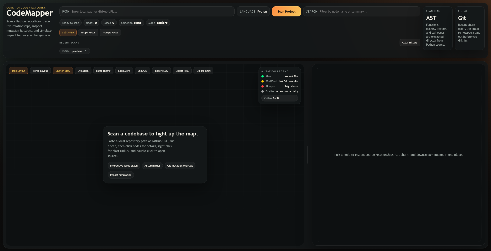
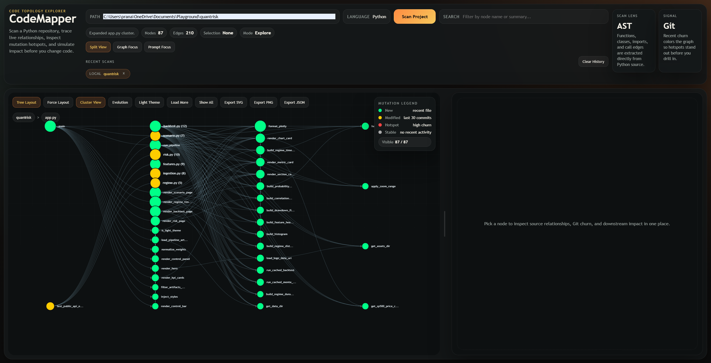
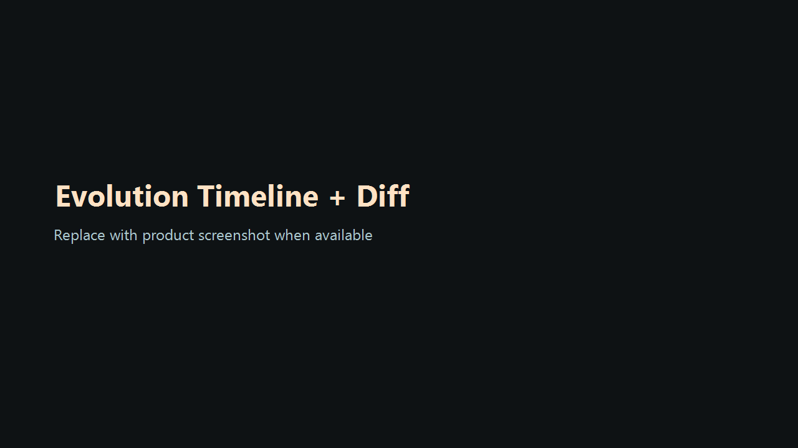
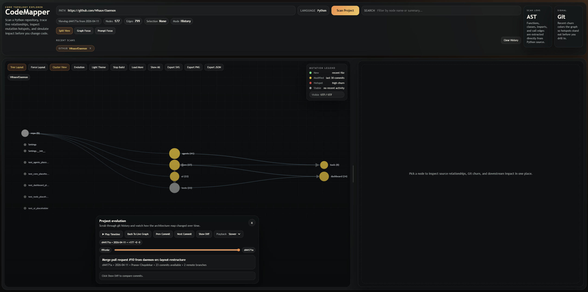
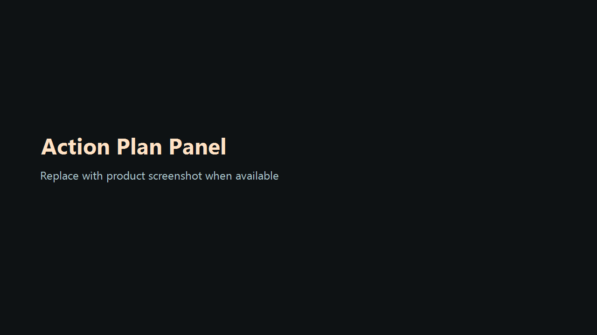

# CodeWeave

Interactive codebase mapper for architecture exploration, AI-assisted code understanding, and impact analysis across multiple languages.

## Overview

CodeWeave scans a repository, extracts code symbols, builds a dependency graph, enriches nodes with AI summaries, overlays git mutation data when available, and serves an interactive graph UI for exploration.

## Supported Languages

- Python: full AST-backed mapping with function, method, class, call-edge, summary, blast-radius, and git-mutation support
- TypeScript / JavaScript: static symbol extraction for classes, functions, methods, and inferred call edges
- Go: static extraction for types, functions, receiver methods, and inferred call edges
- Java: static extraction for classes, interfaces, enums, methods, and inferred call edges

## Core Features

- AI-powered node summaries using Groq with local caching and safe fallback behavior
- Blast radius simulation using reverse BFS over the dependency graph
- Git mutation overlays with PyDriller for Python repositories with git history
- Interactive graph exploration with D3.js, Monaco source viewing, node search, detail drill-down, and graph-aware chat
- Tree and force layout modes for exploring the codebase from different angles
- Evolution mode for scrubbing through git history and viewing architecture snapshots commit by commit
- Commit diff intelligence with per-frame file status summaries and patch previews
- Blast-to-action planning with generated rollout checklist, risk hotspots, and Markdown export

## UI Highlights

- Dashboard-style topology explorer with a scan bar, quick metrics, recent scans, and responsive layout behavior
- Language selector in the top scan bar
- Local-path and GitHub-repo scanning
- Search by node name or summary
- Hover tooltips with one-line node context
- Progressive loading controls for larger graphs
- Clustered exploration and breadcrumb-style navigation
- Recent scan history and saved chat history
- Light and dark themes
- Split view, focus modes, and draggable pane divider
- Node detail panel with summaries, chat, mutation data, blast controls, callers, and callees
- Context-backed chat with node-scoped references (selected node, callers, callees, and project insights)
- Evolution overlay with timeline scrubber, commit playback, commit metadata, and a live-graph reset action
- Export graph as SVG, PNG, or JSON

## Performance Notes

- Summary generation is batched to reduce rate-limit pressure and speed up scans
- If Groq rate-limits or JSON generation fails, the scan falls back quickly instead of hanging the graph build
- Large non-project directories such as `.git`, `.venv`, `node_modules`, `dist`, and `build` are skipped
- Graph panning and resizing were tuned to reduce UI lag on denser graphs
- Flask startup is configured without the unstable debug reloader by default

## Setup

1. Clone the repository.
2. Open a terminal in the project root.
3. Create a virtual environment:

```powershell
python -m venv .venv
```

4. Activate it:

```powershell
.venv\Scripts\Activate.ps1
```

5. Install dependencies:

```powershell
pip install -r requirements.txt
```

6. Add your `GROQ_API_KEY` to `.env`:

```env
GROQ_API_KEY=your_groq_api_key_here
```

7. Start the server:

```powershell
python server\app.py
```

8. Open [http://127.0.0.1:5050](http://127.0.0.1:5050).

If PowerShell blocks activation:

```powershell
Set-ExecutionPolicy -Scope Process Bypass
.venv\Scripts\Activate.ps1
```

## How To Use

1. Choose a language from the `Language` selector.
2. Enter either a local absolute project path or a GitHub repository URL.
3. Click `Scan Project`.
4. Click a node to inspect details, callers, callees, summaries, and mutation metadata.
5. Use `Simulate Blast Radius` to estimate downstream impact.
6. Double-click a node or use `Open Source` to inspect implementation.
7. Ask the graph questions in chat such as:
   `What breaks if I change this node?`
   `Where should I add feature X?`
   `Which modules are tightly coupled?`
8. Click `Evolution` to open the time-travel view and scrub through repository history.

## Evolution Mode

Evolution mode opens a separate timeline panel over the graph and lets you:

- inspect commit-by-commit snapshots of the scanned repository
- scrub manually across the available commit range
- play the timeline automatically when at least two commits are available
- step using `Prev Commit` and `Next Commit`, and monitor frame progress with counter badges
- tune playback with `Faster`, `Slower`, and `Slowest` controls
- jump back to the current live graph instantly
- load per-commit diffs with `Show Diff`, including file status counts and patch preview excerpts

For GitHub scans, CodeWeave now tries to pull broader branch history for the timeline instead of relying only on the initial shallow scan state.

Important note:
- If the scanned repository exposes only one reachable commit, playback will stay disabled because there is no second snapshot to animate.

## Current Interface

The current UI includes:

- a top command bar for path input, language selection, scanning, search, quick metrics, and recent scans
- a graph workspace with tree/force layout switching, cluster view, export tools, evolution access, and mutation legend
- a right-side inspection panel for summaries, chat, mutation context, blast-radius controls, and relationship tracing
- a responsive layout that adapts across laptop and desktop screens

## Recommended Run Command

For the most stable local startup, use the project virtualenv:

```powershell
.venv\Scripts\python server\app.py
```

## Project Structure

```text
codemapper/
+-- frontend/
+-- git_tracker/
+-- graph/
+-- parser/
+-- plugins/
|   +-- python/
|   +-- typescript/
|   +-- go/
|   \-- java/
+-- server/
+-- .env
+-- requirements.txt
+-- summaries_cache.json
\-- README.md
```

## Architecture Notes

- `server/app.py` is now a thin Flask composition layer that owns routing only.
- `server/repository_service.py` encapsulates GitHub clone caching, git history access, and commit snapshot extraction.
- `server/chat_service.py` builds graph-aware AI context so the chat endpoint does not mix HTTP concerns with architecture reasoning.
- `server/state.py` centralizes in-memory graph and history state for the current process.
- `frontend/browser_store.js` isolates browser persistence concerns such as IndexedDB graph snapshots and localStorage-backed UI history.
- `frontend/graph_state.js` holds shared graph UI state so extracted frontend modules do not reach through the coordinator ad hoc.
- `frontend/graph_renderer.js` owns SVG shell creation plus tree/force graph rendering concerns.
- `frontend/graph_effects_controller.js` owns graph visual state such as search highlighting, hover tracing, and blast-radius styling.
- `frontend/graph_ui_controller.js` owns theme, pane layout, export, Monaco, and toolbar interaction orchestration.
- `frontend/history_controller.js` owns evolution timeline loading and playback behavior.
- `frontend/node_interactions.js` owns tooltip behavior, cluster expansion, and node-level interaction wiring.
- `frontend/scan_controller.js` owns scan submission, language loading, recent-scan persistence, and scan-overlay orchestration.
- `plugins/` isolates language-specific graph extraction behind a common plugin contract.

## Testing

Run the current unit suite with:

```powershell
python -m unittest discover -s tests -v
```

Run the full verified integration path with the project virtualenv:

```powershell
.venv\Scripts\python.exe -m unittest discover -s tests -v
```

Run the browser smoke suite with Playwright after installing dev dependencies:

```powershell
npm install
npm run smoke
```

The Playwright config now boots the local Flask app automatically, and the smoke suite scans a tiny TypeScript fixture repo to verify the end-to-end graph flow without depending on Groq availability.
The browser suite also exercises blast-radius actions, export downloads, theme/history persistence, chat rendering, and Evolution mode on a temporary multi-commit git fixture.

If your server is running on a different URL, set:

```powershell
$env:CODEWEAVE_BASE_URL="http://127.0.0.1:5050"
```

The suite currently covers:

- blast-radius computation
- plugin registry and TypeScript extraction smoke coverage
- repository URL normalization and archive extraction safety
- graph-aware chat context generation
- Flask API route behavior for common success/error paths
- end-to-end Flask integration for scan, graph, node, history, and history-snapshot flows under the project virtualenv
- browser smoke checks for the dashboard shell and core graph controls via Playwright
- evolution timeline playback toggles, commit navigation, and diff loading smoke checks

## Screenshots

### Main Dashboard



Shows the scan bar, graph workspace, mutation legend, and right-side detail panel before a graph is loaded.

### Selected Node Workflow



Shows the graph populated with a scanned project, the selected node summary, saved chats, mutation context, and blast-radius actions.

### Evolution Mode



Shows commit playback controls, timeline navigation, and commit diff intelligence from the Evolution panel.



Shows the evolution overlay in playback mode with commit transitions.

### Action Plan Panel



Shows node-level blast-to-action planning with impacted modules, risk hotspots, test focus, and exportable rollout checklist.

## License

MIT
